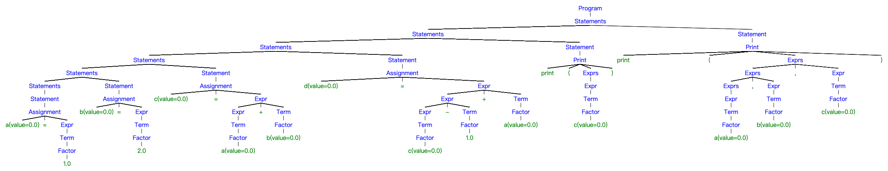
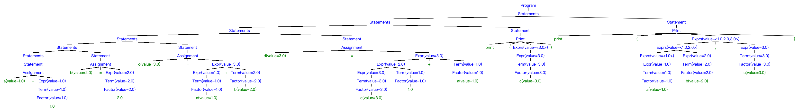
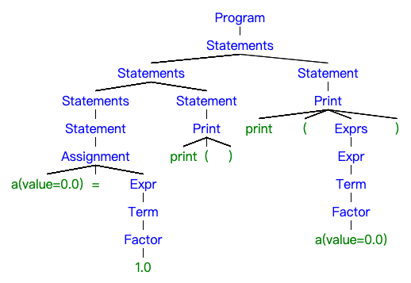
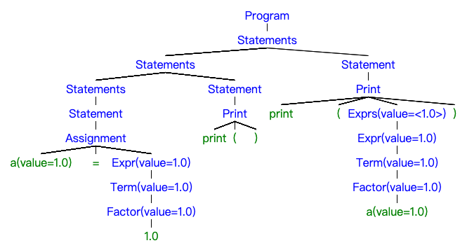
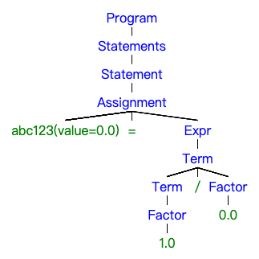

<h3 align="center">编译原理实践第10-11次课<br/>基于PLY的Python解析-1</h3>
<p align="center">张昊 &nbsp;&nbsp; 1927405160</p>

### 概述

使用 Python3 以及 PLY 库实现了简易的 Python 解析器。主要涉及的知识有语法分析，语法制导翻译。完成了以下内容的解析：赋值语句、完整的四则运算、print语句。

### 编程说明

- **语言**：Python3
- **文件编码**：UTF-8 
- **依赖**：PLY
- **测试环境**：Python 3.8.10

#### Python程序的解析

设计了如下文法来实现词法分析：

```
PRINT -> 'print'
ID -> [A-Za-z_][A-Za-z0-9_]*
NUMBER -> -?\d+
```

> 识别 ID，首先检查是否为保留字print，若是则申明其类型，否则为 ID

设计了如下语法来实现语法分析

```
program -> statements
statements -> statements statement | statement
statement -> assignment | expr | print
assignment -> ID '=' expr
expr -> expr '+' term | expr '-' term | term
term -> term '*' factor | term '/' factor | factor
factor -> ID | NUMBER | '(' expr ')'
exprs -> exprs ',' expr | expr
print : PRINT '(' exprs ')' | PRINT '(' ')'
```

其中，expr、term、factor 定义了四则运算的语法；exprs、print 实现了支持不定长参数的 print 函数。另外定义了一系列节点，与语法分析过程中相对应：

```python
class _node:
    """ 所有节点的基类 """
    def __init__(self, data):
        self._data = data
        self._children = []
        self._value = None
    @property
    def value(self):
        return self._value
    @value.setter
    def value(self, value):
        self._value = value
    def child(self, i):
        assert -len(self._children) <= i < len(self._children)
        return self._children[i]
    @property
    def children(self):
        return self._children
    def add(self, node):
        self._children.append(node)
class NonTerminal(_node):
    """ 非终结符节点，提供type表示非终结符的类型，value（可选）为值 """
    @property
    def type(self):
        return self._data
    def __str__(self):
        if len(self.children) == 0: children = ''
        else: children = ' ' + ' '.join(map(str, self.children))
        if self._value is not None:
            val = str(self._value).replace(' ', '').replace('[', '<').replace(']', '>')
            return f"[{self.type}(value={val}){children}]"
        else: return f"[{self.type}{children}]"
class Number(_node):
    """ 数字节点，value为值 """
    def __init__(self, data):
        super(Number, self).__init__(data)
        self._data = 'number'
        self._value = float(data)
    def __str__(self):
        return f'[{self._value}]'
class ID(_node):
    """ 标识符节点，提供id表示标识符名称，value为值 """
    @property
    def id(self):
        return self._data
    def __init__(self, data):
        super(ID, self).__init__(data)
        self._value = 0.0
    def __str__(self):
        id_ = self._data
        val = self._value
        return f"[{id_}(value={val})]"
class Terminal(_node):
    """ 除标识符以外的终结符节点，提供text表示其内容 """
    @property
    def text(self):
        return self._data
    def __str__(self):
        return f'[{self._data}]'
```

通过各节点的 `__str__` 可以将其转换为语法树的字符串表示。

#### 语法制导翻译

如上一小节的代码所示，每个节点都有一个 value 属性，用来保存节点的值（如没有值则为None）。另外设计了一个变量表，用以保存每个变量的值。具体地，当使用赋值语句为一个变量赋值时，会在变量表中添加名为该变量名的记录；当访问一个变量的值时，会到变量表中查找该变量的值，如不存在则报错。定义了如下的动作（其中 `<...>` 为列表）：

```
assignment -> ID '=' expr  { ID.value = expr.value; var_table[ID.id] = expr.value; }
expr -> expr1 '+' term  { expr.value = expr1.value + term.value; }
expr -> expr1 '-' term  { expr.value = expr1.value - term.value; }
expr -> term  { expr.value = term.value; }
term -> term1 '*' factor  { term.value = term1.value * factor.value; }
term -> term1 '/' factor  { term.value = term1.value / factor.value; }
term -> factor { term.value = factor.value; }
factor -> ID { ID.value = var_table[ID.id]; factor.value = ID.value; }
factor -> NUMBER  { factor.value = NUMBER.value; }
factor -> '(' expr ')'  { fact.value = expr.value; }
exprs -> exprs1 ',' expr  { exprs.value = exprs1.value + <expr.value>; }
exprs -> expr  { exprs.value = <expr.value>; }
print -> PRINT '(' exprs ')'  { print(*exprs.value); }
print -> PRINT '(' ')'  { print(); }
```

采用深度优先的顺序遍历整个语法树，具体实现详见代码。

### 运行

项目结构为：

```
.
├── README.pdf    # 本文档
├── example.py    # 输入文件
├── main.py       # 主程序
├── node.py       # 节点定义文件
├── parser.out    # PLY生成的文件
├── parsetab.py   # PLY生成的文件
├── py_lex.py     # 词法分析文件
├── py_yacc.py    # 语法分析文件
└── translation.py    # 翻译器
```

主程序接受一个参数，为输入文件的路径。运行方法如下：

~~~bash
$ python3 main.py example.py
~~~

输入文件如下：

~~~python
a=1
b=2
c=a+b
d=c-1+a
print(c)
print(a,b,c)
~~~

输出如下：

~~~
分析前的语法树： [Program [Statements [Statements [Statements [Statements [Statements [Statements [Statement [Assignment [a(value=0.0)] [=] [Expr [Term [Factor [1.0]]]]]]] [Statement [Assignment [b(value=0.0)] [=] [Expr [Term [Factor [2.0]]]]]]] [Statement [Assignment [c(value=0.0)] [=] [Expr [Expr [Term [Factor [a(value=0.0)]]]] [+] [Term [Factor [b(value=0.0)]]]]]]] [Statement [Assignment [d(value=0.0)] [=] [Expr [Expr [Expr [Term [Factor [c(value=0.0)]]]] [-] [Term [Factor [1.0]]]] [+] [Term [Factor [a(value=0.0)]]]]]]] [Statement [Print [print] [(] [Exprs [Expr [Term [Factor [c(value=0.0)]]]]] [)]]]] [Statement [Print [print] [(] [Exprs [Exprs [Exprs [Expr [Term [Factor [a(value=0.0)]]]]] [,] [Expr [Term [Factor [b(value=0.0)]]]]] [,] [Expr [Term [Factor [c(value=0.0)]]]]] [)]]]]]
运行结果：
3.0
1.0 2.0 3.0
分析后的语法树： [Program [Statements [Statements [Statements [Statements [Statements [Statements [Statement [Assignment [a(value=1.0)] [=] [Expr(value=1.0) [Term(value=1.0) [Factor(value=1.0) [1.0]]]]]]] [Statement [Assignment [b(value=2.0)] [=] [Expr(value=2.0) [Term(value=2.0) [Factor(value=2.0) [2.0]]]]]]] [Statement [Assignment [c(value=3.0)] [=] [Expr(value=3.0) [Expr(value=1.0) [Term(value=1.0) [Factor(value=1.0) [a(value=1.0)]]]] [+] [Term(value=2.0) [Factor(value=2.0) [b(value=2.0)]]]]]]] [Statement [Assignment [d(value=3.0)] [=] [Expr(value=3.0) [Expr(value=2.0) [Expr(value=3.0) [Term(value=3.0) [Factor(value=3.0) [c(value=3.0)]]]] [-] [Term(value=1.0) [Factor(value=1.0) [1.0]]]] [+] [Term(value=1.0) [Factor(value=1.0) [a(value=1.0)]]]]]]] [Statement [Print [print] [(] [Exprs(value=<3.0>) [Expr(value=3.0) [Term(value=3.0) [Factor(value=3.0) [c(value=3.0)]]]]] [)]]]] [Statement [Print [print] [(] [Exprs(value=<1.0,2.0,3.0>) [Exprs(value=<1.0,2.0>) [Exprs(value=<1.0>) [Expr(value=1.0) [Term(value=1.0) [Factor(value=1.0) [a(value=1.0)]]]]] [,] [Expr(value=2.0) [Term(value=2.0) [Factor(value=2.0) [b(value=2.0)]]]]] [,] [Expr(value=3.0) [Term(value=3.0) [Factor(value=3.0) [c(value=3.0)]]]]] [)]]]]]
当前变量表： {'a': 1.0, 'b': 2.0, 'c': 3.0, 'd': 3.0}
~~~

> 如果图片不清晰，请点击如下链接：[http://repo.holgerbest.top/html/ply_python.html](http://repo.holgerbest.top/html/ply_python.html)

分析前的语法树：



分析后的语法树：



下面给出一些特殊的输入：

输入文件：

```python
a = 1
print()
print(a)
```

输出：

```
分析前的语法树： [Program [Statements [Statements [Statements [Statement [Assignment [a(value=0.0)] [=] [Expr [Term [Factor [1.0]]]]]]] [Statement [Print [print] [(] [)]]]] [Statement [Print [print] [(] [Exprs [Expr [Term [Factor [a(value=0.0)]]]]] [)]]]]]
运行结果：

1.0
分析后的语法树： [Program [Statements [Statements [Statements [Statement [Assignment [a(value=1.0)] [=] [Expr(value=1.0) [Term(value=1.0) [Factor(value=1.0) [1.0]]]]]]] [Statement [Print [print] [(] [)]]]] [Statement [Print [print] [(] [Exprs(value=<1.0>) [Expr(value=1.0) [Term(value=1.0) [Factor(value=1.0) [a(value=1.0)]]]]] [)]]]]]
当前变量表： {'a': 1.0}
```

分析前的语法树：



分析后的语法树：




输入文件：

```python
abc123 = 1/0
```

输出：

```
分析前的语法树： [Program [Statements [Statement [Assignment [abc123(value=0.0)] [=] [Expr [Term [Term [Factor [1.0]]] [/] [Factor [0.0]]]]]]]]
运行结果：
除数不能为0
```

分析前的语法树：



输入文件：

```python
abc123 = 123
++abc123
```

输出：

```
Syntax error '+' at line 2
```

