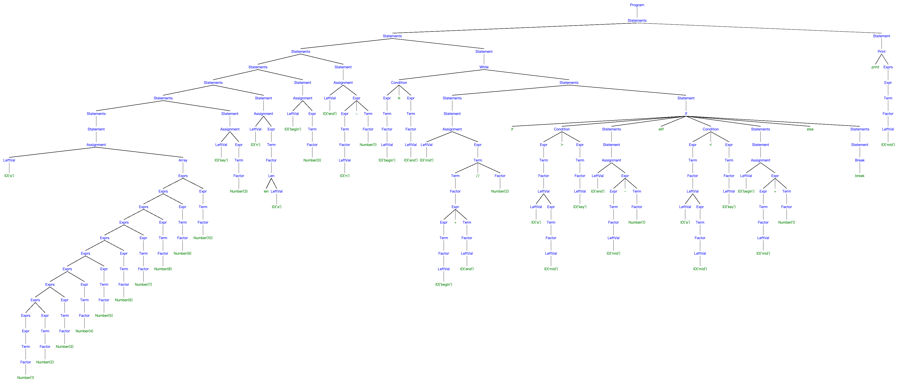
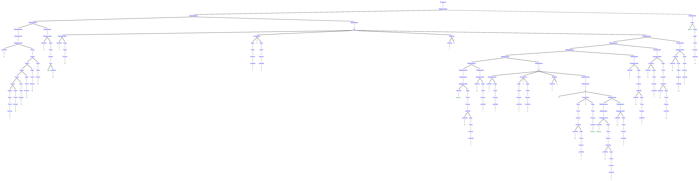

<h3 align="center">编译原理实践第10-11次课<br/>基于PLY的Python解析-1</h3>
<p align="center">张昊 &nbsp;&nbsp; 1927405160</p>

### 概述

使用 Python3 以及 PLY 库实现了简易的 Python 解析器。主要涉及的知识有语法分析，语法制导翻译。
除了赋值语句、完整的四则运算、print语句外，完成了以下内容的解析：选择语句、循环语句、列表、len函数、下标访问。

### 编程说明

- **语言**：Python3
- **文件编码**：UTF-8 
- **依赖**：PLY
- **测试环境**：Python 3.8.10

#### Python程序的解析

设计了如下文法来实现词法分析：

```
运算符定义略
保留字：print len if elif while for break
ID -> [A-Za-z_][A-Za-z0-9_]*
NUMBER -> \d+
```

> 识别 ID，首先检查是否为保留字，若是则申明其类型，否则为 ID

设计了如下语法来实现语法分析

```
program : statements
statements : statements statement | statement
statement : assignment | expr | print | if | while | for | break
assignment : leftval ASSIGN expr | leftval ASSIGN array
leftval : leftval LBRACKET expr RBRACKET | ID  # 左值，可以被赋值、读取值的符号
expr : expr PLUS term | expr MINUS term | term
term : term TIMES factor | term DIVIDE factor | term EDIVIDE factor | factor
factor : leftval | NUMBER | len | LPAREN expr RPAREN
exprs : exprs COMMA expr | expr
len : LEN LPAREN leftval RPAREN
print : PRINT LPAREN exprs RPAREN | PRINT LPAREN RPAREN
array : LBRACKET exprs RBRACKET | LBRACKET RBRACKET
selfvar : leftval DPLUS | leftval DMINUS
condition : expr LT expr | expr LE expr | expr GT expr | expr GE expr | expr EQ expr | expr NE expr | expr
if : IF LPAREN condition RPAREN LBRACE statements RBRACE
   | IF LPAREN condition RPAREN LBRACE statements RBRACE ELSE LBRACE statements RBRACE
   | IF LPAREN condition RPAREN LBRACE statements RBRACE ELIF LPAREN condition RPAREN LBRACE statements RBRACE ELSE LBRACE statements RBRACE
while : WHILE LPAREN condition RPAREN LBRACE statements RBRACE
for : FOR LPAREN assignment SEMICOLON condition SEMICOLON selfvar RPAREN LBRACE statements RBRACE
break : BREAK
```

其中，expr、term、factor 定义了四则运算的语法；exprs、print 实现了支持不定长参数的 print 函数。另外定义了一系列节点，与语法分析过程中相对应：

```python
class _node:
    """ 所有节点的基类 """
    def __init__(self, data):
        self._data = data
        self._children = []
        self._value = None
    @property
    def value(self):
        return self._value
    @value.setter
    def value(self, value):
        self._value = value
    def child(self, i):
        assert -len(self._children) <= i < len(self._children)
        return self._children[i]
    @property
    def children(self):
        return self._children
    def add(self, node):
        self._children.append(node)
class NonTerminal(_node):
    """ 非终结符节点，提供type表示非终结符的类型，value（可选）为值 """
    @property
    def type(self):
        return self._data
    def __str__(self):
        if len(self.children) == 0: children = ''
        else: children = ' ' + ' '.join(map(str, self.children))
        if self._value is not None:
            val = str(self._value).replace(' ', '').replace('[', '<').replace(']', '>')
            return f"[{self.type}(value={val}){children}]"
        else: return f"[{self.type}{children}]"
class Number(_node):
    """ 数字节点，value为值 """
    def __init__(self, data):
        super(Number, self).__init__(data)
        self._data = 'number'
        self._value = float(data)
    def __str__(self):
        return f'[{self._value}]'
class ID(_node):
    """ 标识符节点，提供id表示标识符名称，value为值 """
    @property
    def id(self):
        return self._data
    def __init__(self, data):
        super(ID, self).__init__(data)
        self._value = 0.0
    def __str__(self):
        id_ = self._data
        val = self._value
        return f"[{id_}(value={val})]"
class Terminal(_node):
    """ 除标识符以外的终结符节点，提供text表示其内容 """
    @property
    def text(self):
        return self._data
    def __str__(self):
        return f'[{self._data}]'
```

通过各节点的 `__str__` 可以将其转换为语法树的字符串表示。

#### 语法制导翻译

如上一小节的代码所示，每个节点都有一个 value 属性，用来保存节点的值（如没有值则为None）。另外设计了一个变量表，用以保存每个变量的值。具体地，当使用赋值语句为一个变量赋值时，会在变量表中添加名为该变量名的记录；当访问一个变量的值时，会到变量表中查找该变量的值，如不存在则报错。定义了如下的动作（其中 `<...>` 为列表）：

```
assignment -> leftval ASSIGN expr | leftval ASSIGN array { value = expr.value; set_value(var_table, leftval.id, value); }
leftval -> leftval1 LLIST expr RLIST  { leftval.id = (leftval1.id, expr.value);
                                        leftval.value = get_value(var_table, leftval.id); }
leftval -> ID  { leftval.id = (ID.id, None);
                 if (ID.value != NIL) { set_value(var_table, leftval.id, ID.value); } }
leftval -> leftval1 LLIST expr RLIST  { leftval.id = (leftval1.id, expr.value); }
expr -> expr1 '+' term  { expr.value = expr1.value + term.value; }
expr -> expr1 '-' term  { expr.value = expr1.value - term.value; }
expr -> term  { expr.value = term.value; }
term -> term1 '*' factor  { term.value = term1.value * factor.value; }
term -> term1 '/' factor  { term.value = term1.value / factor.value; }
term -> term1 '//' factor  { term.value = term1.value // factor.value; }
term -> factor { term.value = factor.value; }
factor -> leftval  { value = get_value(var_table, leftval.id); factor.value = value; }
factor -> NUMBER  { factor.value = NUMBER.value; }
factor -> len  { factor.value = len.value; }
factor -> '(' expr ')'  { fact.value = expr.value; }
exprs -> exprs1 ',' expr  { exprs.value = exprs1.value + [expr.value]; }
exprs -> expr  { exprs.value = [expr.value]; }
print -> PRINT '(' exprs ')'  { print(*exprs.value); }
print -> PRINT '(' ')'  { print(); }
len -> LEN '(' leftval ')'  { len.value = len(get_value(var_table, leftval.id)) }
array -> '[' exprs ']'  { array.value = exprs.value; }
array -> '[' ']' { array.value = []; }
selfvar -> leftval '++'  { value = get_value(var_table, tree.child(0).id);
                           value = value + 1;
                           set_value(var_table, leftval.id, value); }
selfvar -> leftval '--'  { value = get_value(var_table, tree.child(0).id);
                           value = value - 1;
                           set_value(var_table, leftval.id, value); }
condition -> expr '<' expr1  { condition.value = exp.value < expr1.value; }
condition -> expr '<=' expr1  { condition.value = exp.value <= expr1.value; }
condition -> expr '>' expr1  { condition.value = exp.value > expr1.value; }
condition -> expr '>=' expr1  { condition.value = exp.value >= expr1.value; }
condition -> expr '==' expr1  { condition.value = exp.value == expr1.value; }
condition -> expr '!=' expr1  { condition.value = exp.value != expr1.value; }
condition -> expr  { condition.value = bool(exp.value); }
```

采用深度优先的顺序遍历整个语法树，具体实现详见代码。

### 运行

项目结构为：

```
.
├── README.pdf    # 本文档
├── binary_search.py    # 输入文件1
├── select_sort.py      # 输入文件2
├── main.py       # 主程序
├── node.py       # 节点定义文件
├── parser.out    # PLY生成的文件
├── parsetab.py   # PLY生成的文件
├── py_lex.py     # 词法分析文件
├── py_yacc.py    # 语法分析文件
└── translation.py    # 翻译器
```

主程序接受一个参数，为输入文件的路径。运行方法如下：

~~~bash
$ python3 main.py <py-file>
~~~

输入文件： binary_search.py

~~~
a=[1,2,3,4,5,6,7,8,9,10]

key=3

n=len(a)

begin=0
end=n-1

while(begin<=end){
    mid=(begin+end)//2
    if(a[mid]>key){
        end=mid-1
    }
    elif(a[mid]<key){
        begin=mid+1
    }
    else{
        break
    }
}
print(mid)
~~~

输出如下：

~~~
语法树： [Program [Statements [Statements [Statements [Statements [Statements [Statements [Statements [Statement [Assignment [LeftVal ID('a')] [Array [Exprs [Exprs [Exprs [Exprs [Exprs [Exprs [Exprs [Exprs [Exprs [Exprs [Expr [Term [Factor Number(1)]]]] [Expr [Term [Factor Number(2)]]]] [Expr [Term [Factor Number(3)]]]] [Expr [Term [Factor Number(4)]]]] [Expr [Term [Factor Number(5)]]]] [Expr [Term [Factor Number(6)]]]] [Expr [Term [Factor Number(7)]]]] [Expr [Term [Factor Number(8)]]]] [Expr [Term [Factor Number(9)]]]] [Expr [Term [Factor Number(10)]]]] ]]]] [Statement [Assignment [LeftVal ID('key')] [Expr [Term [Factor Number(3)]]]]]] [Statement [Assignment [LeftVal ID('n')] [Expr [Term [Factor [Len [len] [LeftVal ID('a')] ]]]]]]] [Statement [Assignment [LeftVal ID('begin')] [Expr [Term [Factor Number(0)]]]]]] [Statement [Assignment [LeftVal ID('end')] [Expr [Expr [Term [Factor [LeftVal ID('n')]]]] [-] [Term [Factor Number(1)]]]]]] [Statement [While [Condition [Expr [Term [Factor [LeftVal ID('begin')]]]] [≤] [Expr [Term [Factor [LeftVal ID('end')]]]]] [Statements [Statements [Statement [Assignment [LeftVal ID('mid')] [Expr [Term [Term [Factor [Expr [Expr [Term [Factor [LeftVal ID('begin')]]]] [+] [Term [Factor [LeftVal ID('end')]]]] ]] [//] [Factor Number(2)]]]]]] [Statement [If [if] [Condition [Expr [Term [Factor [LeftVal [LeftVal ID('a')] [Expr [Term [Factor [LeftVal ID('mid')]]]] ]]]] [＞] [Expr [Term [Factor [LeftVal ID('key')]]]]] [Statements [Statement [Assignment [LeftVal ID('end')] [Expr [Expr [Term [Factor [LeftVal ID('mid')]]]] [-] [Term [Factor Number(1)]]]]]] [elif] [Condition [Expr [Term [Factor [LeftVal [LeftVal ID('a')] [Expr [Term [Factor [LeftVal ID('mid')]]]] ]]]] [＜] [Expr [Term [Factor [LeftVal ID('key')]]]]] [Statements [Statement [Assignment [LeftVal ID('begin')] [Expr [Expr [Term [Factor [LeftVal ID('mid')]]]] [+] [Term [Factor Number(1)]]]]]] [else] [Statements [Statement [Break [break]]]] ]]] ]]] [Statement [Print [print] [Exprs [Expr [Term [Factor [LeftVal ID('mid')]]]]] ]]]]
运行结果：
2
当前变量表： {'a': [1, 2, 3, 4, 5, 6, 7, 8, 9, 10], 'key': 3, 'n': 10, 'begin': 2, 'end': 3, 'mid': 2}
~~~

> 如果图片不清晰，请点击如下链接：[http://repo.holgerbest.top/html/ply_python.html](http://repo.holgerbest.top/html/ply_python.html)

语法树：



输入文件： select_sort.py

```
a=[1,2,4,3,6,5]

n=len(a)

for(i=0;i<n;i++){
    max_v=a[i]
    i_v=i
    
    for(j=i;j<n;j++){
        if(a[j]>max_v){
            max_v=a[j]
            i_v=j
        }
    }
    
    t=a[i]
    a[i]=a[i_v]
    a[i_v]=t
}
    
print(a)
```

输出：

```
语法树： [Program [Statements [Statements [Statements [Statements [Statement [Assignment [LeftVal ID('a')] [Array [Exprs [Exprs [Exprs [Exprs [Exprs [Exprs [Expr [Term [Factor Number(1)]]]] [Expr [Term [Factor Number(2)]]]] [Expr [Term [Factor Number(4)]]]] [Expr [Term [Factor Number(3)]]]] [Expr [Term [Factor Number(6)]]]] [Expr [Term [Factor Number(5)]]]] ]]]] [Statement [Assignment [LeftVal ID('n')] [Expr [Term [Factor [Len [len] [LeftVal ID('a')] ]]]]]]] [Statement [For [Assignment [LeftVal ID('i')] [Expr [Term [Factor Number(0)]]]] [Condition [Expr [Term [Factor [LeftVal ID('i')]]]] [＜] [Expr [Term [Factor [LeftVal ID('n')]]]]] [SelfVar [LeftVal ID('i')] [++]] [Statements [Statements [Statements [Statements [Statements [Statements [Statement [Assignment [LeftVal ID('max_v')] [Expr [Term [Factor [LeftVal [LeftVal ID('a')] [Expr [Term [Factor [LeftVal ID('i')]]]] ]]]]]]] [Statement [Assignment [LeftVal ID('i_v')] [Expr [Term [Factor [LeftVal ID('i')]]]]]]] [Statement [For [Assignment [LeftVal ID('j')] [Expr [Term [Factor [LeftVal ID('i')]]]]] [Condition [Expr [Term [Factor [LeftVal ID('j')]]]] [＜] [Expr [Term [Factor [LeftVal ID('n')]]]]] [SelfVar [LeftVal ID('j')] [++]] [Statements [Statement [If [if] [Condition [Expr [Term [Factor [LeftVal [LeftVal ID('a')] [Expr [Term [Factor [LeftVal ID('j')]]]] ]]]] [＞] [Expr [Term [Factor [LeftVal ID('max_v')]]]]] [Statements [Statements [Statement [Assignment [LeftVal ID('max_v')] [Expr [Term [Factor [LeftVal [LeftVal ID('a')] [Expr [Term [Factor [LeftVal ID('j')]]]] ]]]]]]] [Statement [Assignment [LeftVal ID('i_v')] [Expr [Term [Factor [LeftVal ID('j')]]]]]]] ]]] ]]] [Statement [Assignment [LeftVal ID('t')] [Expr [Term [Factor [LeftVal [LeftVal ID('a')] [Expr [Term [Factor [LeftVal ID('i')]]]] ]]]]]]] [Statement [Assignment [LeftVal [LeftVal ID('a')] [Expr [Term [Factor [LeftVal ID('i')]]]] ] [Expr [Term [Factor [LeftVal [LeftVal ID('a')] [Expr [Term [Factor [LeftVal ID('i_v')]]]] ]]]]]]] [Statement [Assignment [LeftVal [LeftVal ID('a')] [Expr [Term [Factor [LeftVal ID('i_v')]]]] ] [Expr [Term [Factor [LeftVal ID('t')]]]]]]] ]]] [Statement [Print [print] [Exprs [Expr [Term [Factor [LeftVal ID('a')]]]]] ]]]]
运行结果：
[6, 5, 4, 3, 2, 1]
当前变量表： {'a': [6, 5, 4, 3, 2, 1], 'n': 6, 'i': 6, 'max_v': 1, 'i_v': 5, 'j': 6, 't': 1}
```

语法树：



